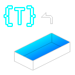

# ArrayPoolCollection

A low-allocation collection library using pooled arrays



## Usage

```cs
// By using the `using` statement, it will be automatically returned to the pool.
using var dict = new ArrayPoolDictionary<int, string>();

// Can be used in the same way as a Dictionary
dict.Add(123, "Alice");
Console.WriteLine(dict[123]);   // "Alice"
```

## Install

ArrayPoolCollection can be installed from NuGet `AndanteSoft.ArrayPoolCollection`.

```
dotnet add package AndanteSoft.ArrayPoolCollection
```

### Unity

Supported version: 2021.2 or later. (API Compatibility Level: .NET Standard 2.1)

My test environment is *TBD*.

Use [NuGetForUnity](https://github.com/GlitchEnzo/NuGetForUnity) to install.

## Feature

It provides the following collections, which are mostly compatible with the default collections:

* `ArrayPoolWrapper<T>` : [`T[]`](https://learn.microsoft.com/en-us/dotnet/api/system.array?view=net-9.0)
* `ArrayPoolList<T>` : [`List<T>`](https://learn.microsoft.com/en-us/dotnet/api/system.collections.generic.list-1?view=net-9.0)
* `ArrayPoolDictionary<TKey, TValue>` : [`Dictionary<TKey, TValue>`](https://learn.microsoft.com/en-us/dotnet/api/system.collections.generic.dictionary-2?view=net-9.0)
* `ArrayPoolHashSet<T>` : [`HashSet<T>`](https://learn.microsoft.com/en-us/dotnet/api/system.collections.generic.hashset-1?view=net-9.0)
* `ArrayPoolStack<T>` : [`Stack<T>`](https://learn.microsoft.com/en-us/dotnet/api/system.collections.generic.stack-1?view=net-9.0)
* `ArrayPoolQueue<T>` : [`Queue<T>`](https://learn.microsoft.com/en-us/dotnet/api/system.collections.generic.queue-1?view=net-9.0)
* `ArrayPoolPriorityQueue<TElement, TPriority>` : [`PriorityQueue<TElement, TPriority>`](https://learn.microsoft.com/en-us/dotnet/api/system.collections.generic.priorityqueue-2?view=net-9.0)

They use `ArrayPool<T>` for their internal arrays, and by calling `Dispose()` when destroyed, they do not generate GC garbage.
These implement almost all APIs available as of .NET 9.

> Therefore, it can also be used to utilize `PriorityQueue`, which was not available in the Unity environment.

In addition, it implements the following alternative collections, although they have some differences in specifications:

* `ArrayPoolBits` : [`BitArray`](https://learn.microsoft.com/en-us/dotnet/api/system.collections.bitarray?view=net-9.0)

Also implement an object pool:

* `ObjectPool`

By utilizing this and reusing instances of `ArrayPool***`, GC garbage can be completely eliminated.
This is also available in the pool of GameObjects in Unity.

Collections can be serialized using [MemoryPack](https://github.com/Cysharp/MemoryPack).

## Fork

### Build

```
dotnet build
```

### Run tests

```
dotnet test
```

### Run benchmarks

```
dotnet run -c Release --project ArrayPoolCollection.Benchmarks
```

### Publish

```
dotnet pack
```

## License

[MIT License](LICENSE)
